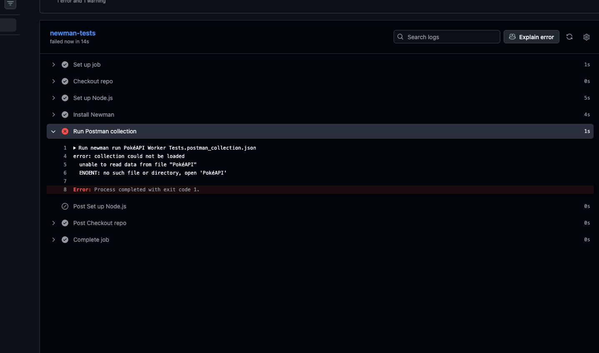

# PokéAPI Cloudflare Workers Tests

Postman + Newman test validating a Cloudflare Workers I built that leverages [PokéAPI](https://pokeapi.co/). The Worker endpoint is `https://pokeapi-worker.edwinhchun.workers.dev` and accepts requests like `/pokemon/{name}`, fetching data from PokéAPI and returning it as its own JSON response.

This repo also runs the Postman collection automatically on every push to the main branch via GitHub Actions, using the same Newman pattern on Ubuntu from my pagination testing repo, but with also some validating infrastructure I vibecoded using Claude.

## What the Worker does

- `GET /pokemon/{name}` → fetches that Pokémon from PokéAPI and returns it
- Invalid Pokémon name → returns a custom `404` with an error message
- Missing Pokémon name in the path → returns a custom `400` with an error message

## What's tested

Three requests, seven assertions total:

| Request | Checks |
|---|---|
| Get Valid Pokemon | Status 200, correct Pokémon name in response, correct `Content-Type` header |
| Get Invalid Pokemon | Status 404, error message present |
| Get Pokemon No Name | Status 400, error message present |

## Running it locally using terminal

```bash
brew install node
npm install -g newman
newman run "PokéAPI Worker Tests.postman_collection.json"
```

## Running it automatically GitHub Actions

Every push to `main` triggers `.github/workflows/newman-tests.yml`, which installs Newman on Linux Ubuntu and runs the collection. You can also trigger it manually from the **Actions** tab via `workflow_dispatch`.

## Problems I hit setting this up and why they happened

**Workflow file needs the `.yml` extension**
GitHub Actions only picks up files inside `.github/workflows/` that end in `.yml` (or `.yaml`). A file without that extension just sits there as an unrecognized file. If a workflow isn't showing up under the Actions tab at all, check the logs to drill down on what caused the error. I was also running into the same problem while attempting to run it locally. After seeing the error response in the Github Actions logs, I was able to successfully run it locally. 

**Quote filenames that contain spaces**
My collection was exported as `PokéAPI Worker Tests.postman_collection.json` with the spaces. After doing some research, I discovered that in a shell command spaces separate arguments so `newman run PokéAPI Worker Tests.postman_collection.json` gets read as four separate arguments instead a file, and Newman fails trying to find a file just called `PokéAPI`. Wrapping the filename in quotes (`newman run "PokéAPI Worker Tests.postman_collection.json"`) tells the shell to execute it as a single argument.



The logs pointed me in the right direction: Newman only picked up `PokéAPI` as the filename and threw `ENOENT: no such file or directory, open 'PokéAPI'` and everything after the first space was dropped as separate arguments.

---

**Built with:** [Cloudflare Workers](https://www.cloudflare.com/products/workers/) · [Postman](https://www.postman.com/) · [PokéAPI](https://pokeapi.co/) · [Claude](https://claude.ai/)
